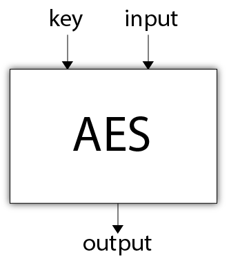
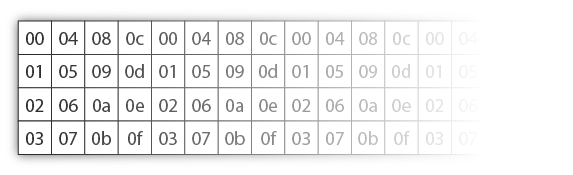
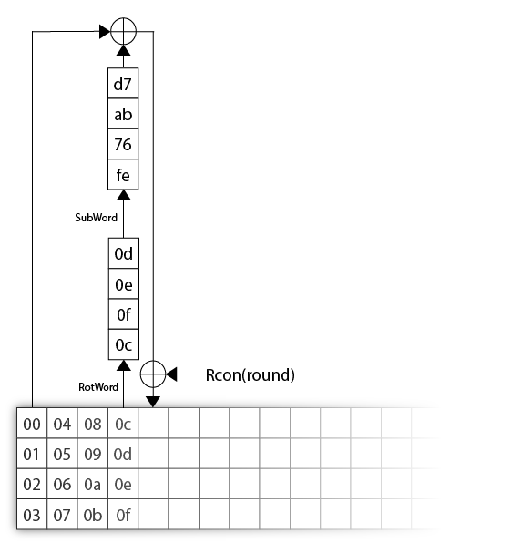
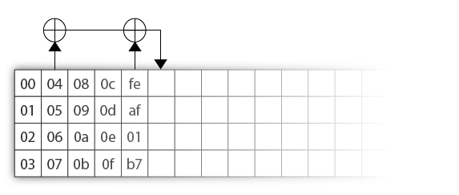
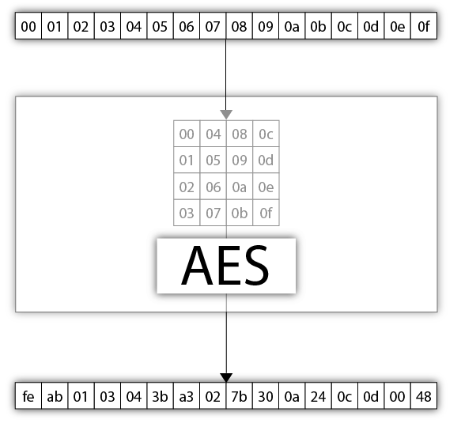
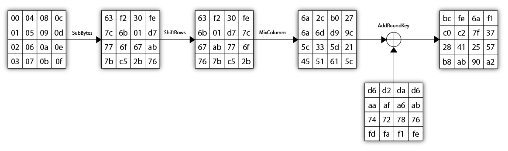

# Set 1: AES



Before we can set foot in the realm of cryptanalysis and begin our adventure, we need a piñata. Something we can squish and squeeze to help us learn the nuts and bolts of **block cipher cryptanalysis**. And for that, why not use the state of the art?

To facilitate the understanding of *AES*, we've split the implementation of the block cipher in several steps. They should not require "too much" time if you already know about **bitwise operations**. If you do not, then pick a *programming language*, and get yourself ready to learn a lot of new things! I would suggest choosing a language that facilitates *bitwise operations* (think C, C++, [Golang](https://golang.org/), ...)

Through-out these, keep in mind that there exist a lot of resources to help you understand *AES*. My favorite ones are the [stick figure explanation of AES](http://www.moserware.com/2009/09/stick-figure-guide-to-advanced.html), the [AES flash animation](http://www.formaestudio.com/rijndaelinspector/archivos/Rijndael_Animation_v4_eng.swf) and of course the dense [official AES standard](http://csrc.nist.gov/publications/fips/fips197/fips-197.pdf).

PS: 🙍🏻‍♂️[RWG]() was kind enough to share an implementation of *AES* made in an **Excel sphreadsheet**. It's crazy I know. It's also really useful because you can use it to verify your implementation for any state transition. (If you need to modify a state's byte, re-write it as `="aa"` with `aa` being the hexadecimal representation of 170.)

## Step: Implementing the keyScheduler: rotWord

*AES* is a block cipher that can encrypt and decrypt no-more-no-less than 128 bits of plaintext. This limitation is usually circumvented by using a [mode of operation](https://en.wikipedia.org/wiki/Block_cipher_mode_of_operation) along with a padding algorithm on top of a block cipher. But this is not important for us here, as we are aiming to attack the core of block ciphers, not their usage.

> Note: if you are interested in mode of operations vulnerabilities. [The Cryptopals challenges](http://www.cryptopals.com) do a great job demonstrating the weakness of a lot of them.

In addition of this 128-bit plaintext, *AES* takes a **variable sized key**. In our attacks we will use *AES-128* which uses -- as its name suggests -- a **128-bit key**. But know that there exist two other variants of *AES* called *AES-192* and *AES-256*, taking respectively 192-bit and 256-bit keys and having their implementation differ slightly from *AES-128*.

To transform a plaintext into a ciphertext, *AES* makes it undergo a number of transformations, one of them is to XOR it with *keys*. Since we only provide *AES* with **a single key**, *AES* will need to derive a number of keys. This number will vary respectively to the version of *AES* you're using. Since we'll use *AES-128*, we'll need it to derive exactly 11 keys.

Now with terms:

* these keys are called **subKeys**.
* The derivation function, usually called a **key schedule**, is named **Key Expansion** in the *AES* standards.

---

We'll create three functions to help us build the `keyExpansion` function: `rotWord`, `subWord` and `rcon`. We'll start with `rotWord` here. Go and create a function named `rotWord`. It should take as input a value of 4 bytes (a 4 byte array, a uint32 value, ...) and return as output a rotation of these 4 bytes as shown in the diagram below:

```
00      01
01  ->  02
02      03
03      00
```

Test your function and make sure it works :)

## Step: Implementing the keyScheduler: subWord

The next helper function we'll need for our key Expansion is `subWord`. SubWord takes an input of 4 bytes like the previous function, and returns an output of 4 bytes as well. SubWord is basically an **Sbox**, each bytes are checked against a look up table and replaced to their associated value. Here's the look up table:

```
   |.0 .1 .2 .3 .4 .5 .6 .7 .8 .9 .A .B .C .D .E .F
---|--|--|--|--|--|--|--|--|--|--|--|--|--|--|--|--|
0. |63 7c 77 7b f2 6b 6f c5 30 01 67 2b fe d7 ab 76
1. |ca 82 c9 7d fa 59 47 f0 ad d4 a2 af 9c a4 72 c0
2. |b7 fd 93 26 36 3f f7 cc 34 a5 e5 f1 71 d8 31 15
3. |04 c7 23 c3 18 96 05 9a 07 12 80 e2 eb 27 b2 75
4. |09 83 2c 1a 1b 6e 5a a0 52 3b d6 b3 29 e3 2f 84
5. |53 d1 00 ed 20 fc b1 5b 6a cb be 39 4a 4c 58 cf
6. |d0 ef aa fb 43 4d 33 85 45 f9 02 7f 50 3c 9f a8
7. |51 a3 40 8f 92 9d 38 f5 bc b6 da 21 10 ff f3 d2
8. |cd 0c 13 ec 5f 97 44 17 c4 a7 7e 3d 64 5d 19 73
9. |60 81 4f dc 22 2a 90 88 46 ee b8 14 de 5e 0b db
a. |e0 32 3a 0a 49 06 24 5c c2 d3 ac 62 91 95 e4 79
b. |e7 c8 37 6d 8d d5 4e a9 6c 56 f4 ea 65 7a ae 08
c. |ba 78 25 2e 1c a6 b4 c6 e8 dd 74 1f 4b bd 8b 8a
d. |70 3e b5 66 48 03 f6 0e 61 35 57 b9 86 c1 1d 9e
e. |e1 f8 98 11 69 d9 8e 94 9b 1e 87 e9 ce 55 28 df
f. |8c a1 89 0d bf e6 42 68 41 99 2d 0f b0 54 bb 16
```

To read this table, split your input in two:

* The 4 most significant bits represent the row.
* The 4 least significant bits represent the column.

**Examples**:

* `01 -> 7c`
* `c2 -> 25`
* `9e -> 0b`

Go ahead and **implement this function**. Below is the Sbox represented in golang, that might be helpful.

```
var sbox_en = [256]byte{
	0x63, 0x7c, 0x77, 0x7b, 0xf2, 0x6b, 0x6f, 0xc5, 0x30, 0x01, 0x67, 0x2b, 0xfe, 0xd7, 0xab, 0x76,
	0xca, 0x82, 0xc9, 0x7d, 0xfa, 0x59, 0x47, 0xf0, 0xad, 0xd4, 0xa2, 0xaf, 0x9c, 0xa4, 0x72, 0xc0,
	0xb7, 0xfd, 0x93, 0x26, 0x36, 0x3f, 0xf7, 0xcc, 0x34, 0xa5, 0xe5, 0xf1, 0x71, 0xd8, 0x31, 0x15,
	0x04, 0xc7, 0x23, 0xc3, 0x18, 0x96, 0x05, 0x9a, 0x07, 0x12, 0x80, 0xe2, 0xeb, 0x27, 0xb2, 0x75,
	0x09, 0x83, 0x2c, 0x1a, 0x1b, 0x6e, 0x5a, 0xa0, 0x52, 0x3b, 0xd6, 0xb3, 0x29, 0xe3, 0x2f, 0x84,
	0x53, 0xd1, 0x00, 0xed, 0x20, 0xfc, 0xb1, 0x5b, 0x6a, 0xcb, 0xbe, 0x39, 0x4a, 0x4c, 0x58, 0xcf,
	0xd0, 0xef, 0xaa, 0xfb, 0x43, 0x4d, 0x33, 0x85, 0x45, 0xf9, 0x02, 0x7f, 0x50, 0x3c, 0x9f, 0xa8,
	0x51, 0xa3, 0x40, 0x8f, 0x92, 0x9d, 0x38, 0xf5, 0xbc, 0xb6, 0xda, 0x21, 0x10, 0xff, 0xf3, 0xd2,
	0xcd, 0x0c, 0x13, 0xec, 0x5f, 0x97, 0x44, 0x17, 0xc4, 0xa7, 0x7e, 0x3d, 0x64, 0x5d, 0x19, 0x73,
	0x60, 0x81, 0x4f, 0xdc, 0x22, 0x2a, 0x90, 0x88, 0x46, 0xee, 0xb8, 0x14, 0xde, 0x5e, 0x0b, 0xdb,
	0xe0, 0x32, 0x3a, 0x0a, 0x49, 0x06, 0x24, 0x5c, 0xc2, 0xd3, 0xac, 0x62, 0x91, 0x95, 0xe4, 0x79,
	0xe7, 0xc8, 0x37, 0x6d, 0x8d, 0xd5, 0x4e, 0xa9, 0x6c, 0x56, 0xf4, 0xea, 0x65, 0x7a, 0xae, 0x08,
	0xba, 0x78, 0x25, 0x2e, 0x1c, 0xa6, 0xb4, 0xc6, 0xe8, 0xdd, 0x74, 0x1f, 0x4b, 0xbd, 0x8b, 0x8a,
	0x70, 0x3e, 0xb5, 0x66, 0x48, 0x03, 0xf6, 0x0e, 0x61, 0x35, 0x57, 0xb9, 0x86, 0xc1, 0x1d, 0x9e,
	0xe1, 0xf8, 0x98, 0x11, 0x69, 0xd9, 0x8e, 0x94, 0x9b, 0x1e, 0x87, 0xe9, 0xce, 0x55, 0x28, 0xdf,
	0x8c, 0xa1, 0x89, 0x0d, 0xbf, 0xe6, 0x42, 0x68, 0x41, 0x99, 0x2d, 0x0f, 0xb0, 0x54, 0xbb, 0x16,
}
```

<!-- isn't subBytes a math operation as well (before being a Sbox)? -->

## Step: Implementing the keyScheduler: rcon

The last helper function `rcon` takes an integer as input, and gives back an array of 4 bytes with the 3 least significant bytes set to 0.

**It is a bit tricky** and is often what bugs people when implementing *AES*.

*AES* operates some of its transformations in the Finite Field `GF(2^8)` defined with the polynomial `X^8 + X^4 + X^3 + X + 1`. **Rcon** is one of them, and is defined as `rcon(i) = [X^i, 0, 0, 0]` in that weird field we just talked about.

I will not ask you to understand what I just wrote, and I'll even advise you to just implement this function using a **look-up table**. At the end of this set, if you want to know more about AES you should come back to this step and re-implement it using math.

Below is the golang code for the look-up table. 

```
var rcon = [256]byte{
0x8d, 0x01, 0x02, 0x04, 0x08, 0x10, 0x20, 0x40, 0x80, 0x1b, 0x36, 0x6c, 0xd8, 0xab, 0x4d, 0x9a,
0x2f, 0x5e, 0xbc, 0x63, 0xc6, 0x97, 0x35, 0x6a, 0xd4, 0xb3, 0x7d, 0xfa, 0xef, 0xc5, 0x91, 0x39,
0x72, 0xe4, 0xd3, 0xbd, 0x61, 0xc2, 0x9f, 0x25, 0x4a, 0x94, 0x33, 0x66, 0xcc, 0x83, 0x1d, 0x3a,
0x74, 0xe8, 0xcb, 0x8d, 0x01, 0x02, 0x04, 0x08, 0x10, 0x20, 0x40, 0x80, 0x1b, 0x36, 0x6c, 0xd8,
0xab, 0x4d, 0x9a, 0x2f, 0x5e, 0xbc, 0x63, 0xc6, 0x97, 0x35, 0x6a, 0xd4, 0xb3, 0x7d, 0xfa, 0xef,
0xc5, 0x91, 0x39, 0x72, 0xe4, 0xd3, 0xbd, 0x61, 0xc2, 0x9f, 0x25, 0x4a, 0x94, 0x33, 0x66, 0xcc,
0x83, 0x1d, 0x3a, 0x74, 0xe8, 0xcb, 0x8d, 0x01, 0x02, 0x04, 0x08, 0x10, 0x20, 0x40, 0x80, 0x1b,
0x36, 0x6c, 0xd8, 0xab, 0x4d, 0x9a, 0x2f, 0x5e, 0xbc, 0x63, 0xc6, 0x97, 0x35, 0x6a, 0xd4, 0xb3,
0x7d, 0xfa, 0xef, 0xc5, 0x91, 0x39, 0x72, 0xe4, 0xd3, 0xbd, 0x61, 0xc2, 0x9f, 0x25, 0x4a, 0x94,
0x33, 0x66, 0xcc, 0x83, 0x1d, 0x3a, 0x74, 0xe8, 0xcb, 0x8d, 0x01, 0x02, 0x04, 0x08, 0x10, 0x20,
0x40, 0x80, 0x1b, 0x36, 0x6c, 0xd8, 0xab, 0x4d, 0x9a, 0x2f, 0x5e, 0xbc, 0x63, 0xc6, 0x97, 0x35,
0x6a, 0xd4, 0xb3, 0x7d, 0xfa, 0xef, 0xc5, 0x91, 0x39, 0x72, 0xe4, 0xd3, 0xbd, 0x61, 0xc2, 0x9f,
0x25, 0x4a, 0x94, 0x33, 0x66, 0xcc, 0x83, 0x1d, 0x3a, 0x74, 0xe8, 0xcb, 0x8d, 0x01, 0x02, 0x04,
0x08, 0x10, 0x20, 0x40, 0x80, 0x1b, 0x36, 0x6c, 0xd8, 0xab, 0x4d, 0x9a, 0x2f, 0x5e, 0xbc, 0x63,
0xc6, 0x97, 0x35, 0x6a, 0xd4, 0xb3, 0x7d, 0xfa, 0xef, 0xc5, 0x91, 0x39, 0x72, 0xe4, 0xd3, 0xbd,
0x61, 0xc2, 0x9f, 0x25, 0x4a, 0x94, 0x33, 0x66, 0xcc, 0x83, 0x1d, 0x3a, 0x74, 0xe8, 0xcb, 0x8d
}
```

**Examples**:

* `rcon(1) = {0x01, 0x00, 0x00, 0x00}`
* `rcon(2) = {0x02, 0x00, 0x00, 0x00}`
* `rcon(3) = {0x04, 0x00, 0x00, 0x00}`
* `rcon(4) = {0x08, 0x00, 0x00, 0x00}`
* ...

---

Are you ready to implement it in math?

You need to understand four things (and we'll skip [the definition of a field](https://en.wikipedia.org/wiki/Field_(mathematics)), which is not useful for us here):

* How can a byte be represented as a polynomial in this field?
* How to do addition in this field
* How to do multiplication in this field
* What to do when the resulting polynomial is larger than `X^8 + X^4 + X^3 + X + 1`?

<!-- WIP -->

## Step: Implement the keyScheduler

We've got all of the functions we need to implement the key scheduler!

Your task is to create a `keyExpansion()` function outputing an `ExpandedKey` value. The `ExpandedKey` value is a series of columns. These columns are all called **words** and are essentially 4 bytes. The first 4 columns correspond to the original 16-byte key (which will be the first *subKey*), the next 4 columns correspond to the next subkey, and on and on... until enough *subKeys* can be created.



In the following picture, imagine that the key provided to *AES* was `0x000102030405060708090a0b0c0d0e0f`. This fills exactly four columns and will be the first *subKey*. To obtain the first column of the next *subKey*, here are the steps:

* Take the value of the previous *subKey*'s last column and give it to `rotWord`
* Then give it to `subWord`
* Then XOR it to the first column of the previous *subKey*
* then XOR it to `rcon(round)` with `round` being the round number (starting at 1). We'll see what that round is later, but basically know that in AES, a plaintext goes through several rounds of transformation. Each round has its own *subKey*. *AES-128* requires 10 rounds, and will use 10 + 1 = 11 *subKeys*.



To obtain the other columns of a *subKey*, just XOR the previous column with the previous *subKey*'s column of the same index.



---

Go ahead and create the `keyExpansion` function.

To test your function, you can use the test vectors from the appendix A.1 of the [AES standard](http://csrc.nist.gov/publications/fips/fips197/fips-197.pdf):

**Remember**: we gave some other good resources to understand and test your implementation [in the main page of this set](/AES/)

## Step 1: Understanding the state of AES



Note a few things:

* The plaintext that AES manipulates is represented as a square of 4 rows and 4 columns.
* This input becomes a "**state**", internal to *AES*, and gets digested through several operations involving **subkeys**.
* A number of these operations are recurrent and gathered in what we call a "**round**", each round make use of a different subkey.
* The **subkeys** are derived from the main key.

---

Your first task will be to implement the internal state of AES. It is visually represented as a 4x4 square where each box is a byte. But this is only a visual representation. In code you can implement that as you want: you could create an internal structure containing 4 arrays of 4 bytes (that would hold the columns of the square), or use an array of 16 bytes... whatever you think is  best.

*Don't worry too much about this*: the important piece here is to represent the bytes correctly. This is because we will operate on these bytes later on. And this step will make more sense as we continue to implement AES. You can always come back here later and re-implement the internal representation of a state.

Once you are done, declare this plaintext in code: `this is one text` and transform it into an AES state. Then implement a function (that you can name `printState`) that will print a state as a 4x4 square on the screen.  **Be careful, the input is represented in columns and not in rows!** Here is what you should see displayed:

```
74 20 6f 74
68 69 6e 65
69 73 65 78
73 20 20 74
```

If you're set, [go to the next step]().

## Step: Implement SubBytes (test vectors)

Here's what a round looks like:



Create a `SubBytes` function that takes a state, and returns or modify the new state after the SubBytes transformation.

What is the SubBytes transformation? It is a S-box: it takes a byte and returns a corresponding byte according to a look-up table.

## Step: Implement ShiftRows  (test vectors)

```
0 1 2 3    0 1 2 3    
4 5 6 7 -> 5 6 7 4
8 9 a b    a b 8 9
c d e f    f c d e
```

> Create a `ShiftRows` function that takes a state and returns or modify the new state after the ShiftRows transformation

## Step: Implement MixColumns (test vectors)

Use the look up tables that basically replace all the multiplication operations. The additions can be seen as XORs. At the end of this section, optionally go back to this section to re-implement MixColumns the "proper way", this means "understanding the math". So doing the multiplications, the reduction modulo the irreducible polynomial of AES, XORing it all.

https://en.wikipedia.org/wiki/Rijndael_mix_columns

explanation of the look up table.

## Step: Implement AddRoundKey

The first phase is called "**pre-whitening**". And is to ⊕ (XOR) your state with the first subKey (which is the original key provided to *AES*). This operation in *AES* is called **AddRoundKey**, and your task now is to implement a function called after this transformation. Your `AddRoundKey` function will take a `round` argument, as well as a `state` and will produce the next state.

This **pre-whitening** is done to avoid losing the first few transformations to the attacker. If no XOR with a subKey was in place, the attacker could compute the internal state of the cipher up to the **AddRoundKey** operation.

---

Test Vectors?

## Step: Implement Encryption (test vectors)

## Step: Implement decryption

Go and implement the decryption.
